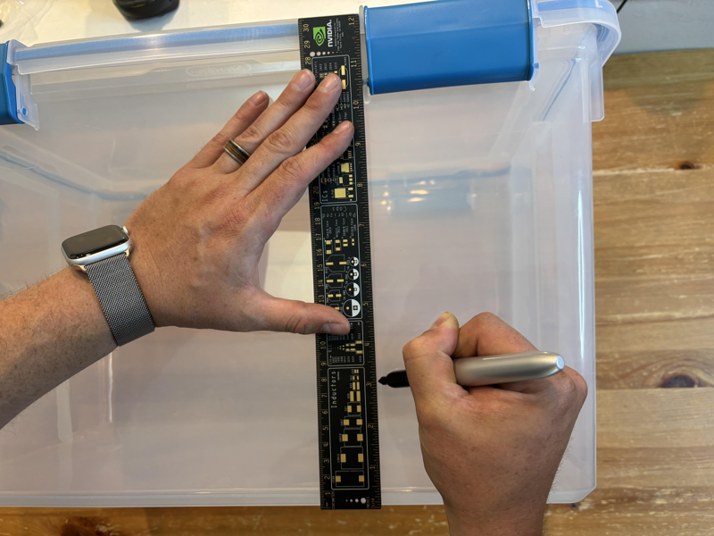

# Automated Modified Tub

## Supplies
- [**54 Quart Sterilite Gasket Tub**](https://www.walmart.com/ip/Sterilite-54-Quart-Clear-Gasket-Box-with-Blue-Latches-Gasket/39922428)
- **Power Drill**
- **1-1/2 Inch Hole Saw Drill Bit**
- **Drill Bit Matching Fan Mounting Hardware**
- [**120mm Ventilation Exhaust Fan and Mounting Hardware**](https://www.amazon.com/gp/product/B009OWVUJ0/ref=ppx_yo_dt_b_search_asin_title?ie=UTF8&th=1)
- **Programmable AC Outlet Timer**
- **2 Inch Wide Paper Tape**
- **2 Inch Wide Masking Tape**
- **Permanent Marker**
- **Ruler**

## Directions

### 1. Mark 1-1/2 Inch Inlet Air Holes
Begin by marking six 1-1/2 inch air inlet holes 3 inches from the bottom of the tub. There will be one inlet on the short sides of the tub and two on the long sides of the tub.

- On the long sides of the tub, these marks should be aligned to the inside of each handle.

- On the short sides of the tub, these marks should be centered.
- Note the presence of a thin, clear, plastic line exactly 3 inches from the bottom of the tub. This can be used instead of a ruler.

### 2. Cut 1-1/2 Inch Air Holes

- Using the **Power Drill** and **1-1/2 Inch Hole Saw Drill Bit**, turn your drill to forward and drill out the center of each of the six 1-1/2 inch holes. Take care to not let the circular saw portion of the bit touch the plastic as this can lead to your tub cracking.

- With all six holes started, turn your drill to reverse and use the circular saw portion of the bit to remove the 1-1/2 inch circles. Apply little pressure and allow the bit to melt through the plastic. This will ensure you get clean holes with no cracks.

### 3. Drill Holes for and Mount Exhaust Fan

- With the tub on its side, position your exhaust fan between the handles on one of the tub's long sides. Ensure the fan is parallel to the bottom of the tub.

- Using your **Power Drill** and **Drill Bit Matching Fan Mounting Hardware**, drill through one of the top two fan holes.

- From inside the tub, insert one of the bolts and affix with its corresponding nut from the outside of the tub.

- Hang the fan from the bolt and position, again ensuring the fan is parallel to the bottom of the tub.
- From the inside of the tub, insert the remaining bolt and affix with its corresponding nut from the outside of the tub.

- Using your **Power Drill** and **Drill Bit Matching Fan Mounting Hardware**, drill the remaining fan hole.

- Between the fan mounting bolts and 1 inch down, make a mark for the 1-1/2 inch fan exhaust.
- Using the **Power Drill** and **1-1/2 Inch Hole Saw Drill Bit**, remove the center of the hole with the drill on forward, then melt through the 1-1/2 inch circle with the drill on reverse.

### 4. Apply Tape to Air Holes

- Cover each of the 7 1-1/2 inch air holes with two layers of **2 Inch Wide Paper Tape**

- Cover each of the 7 1-1/2 inch air holes with a single layer of **2 Inch Wide Masking Tape**

- Slide the fan onto its two mounting bolts.
- Fan is intended to be a hot swappable component and is not secured to the tub beyond it resting on its two bolts. This is handy when removing the tub for harvest or other maintenance tasks.

### 5. Configure Programmable AC Outlet Timer
- Configure **Programmable AC Outlet Timer** to run for 20 seconds every 3 hours. Adjust depending on whether less or more fresh air exchange is desired.

## Automating Your Grow

1. When spawning to bulk, line the tub with a 33 gallon black trash bag used for yard work. This prevents side pins as well as prevents your cake from sitting in any water that may accumulate. Trim the bag to level with the surface of your cake which should be anywhere from the bottom of to half way up the 1-1/2 inch air inlet holes.
2. Seal your tub by latching the lid in place. Leave all layers of tape in place. Do not mount the fan. The tub is now in colonization mode.
3. Once the surface of the cake is 80% - 95% colonized, it's time to switch the tub to fruiting mode. Remove the single layer of **2 Inch Wide Masking Tape** from each of the 7 1-1/2 inch air holes. Mount your exhaust fan configured to run for 20 seconds every three hours, and ensure that your tub gets 8 - 12 hours of light each day.
4. You shouldn't have to open your tub for any reason until your first flush is ready.
5. Harvest your flush, soak the cake for 10 minutes, and put back into fruiting conditions for subsequent flushes.
