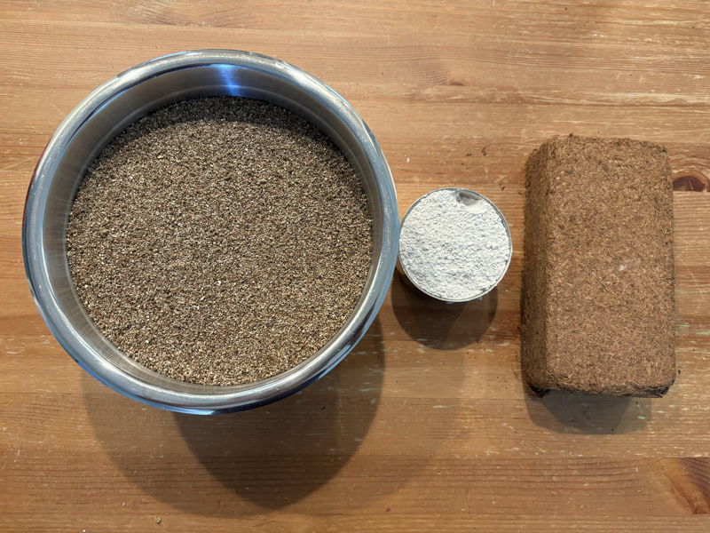

# CVG Substrate

## Ingredients
- **Coco Coir** - 650g brick
- **Vermiculite** - 8 cups
- **Gypsum** - 1 cup
- **Water** - 18 cups

Avoid anything intended for gardening as these are often deliberately contaminated with
trichoderma and treated with salt. Instead, use coir intended for reptiles as these are free from both these potential issues. Brands such as Eco Earth and Coco Bliss are recommended. Similarly, ensure gypsum is mycological grade.

## Supplies
- **5 Gallon Bucket with Lid**

- **Pot to Boil Water**

## Directions
1. Fill **5 Gallon Bucket** with **Coco Coir**, **Vermiculite**, and top with **Gypsum**.

1. Fill **Pot** with **Water** and bring to a boil.
1. Add boiling **Water** to **Bucket** and seal with **Lid**

1. Allow the CVG substrate mixture to cool. Once at room temperature, the substrate is ready to mix and use.
